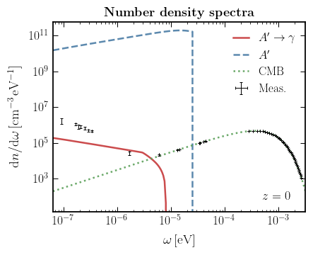

# Edges and Endpoints in 21-cm from Resonant Photon Production

Code repository for the papers
**Edges and Endpoints in 21-cm from Resonant Photon Production**
by Andrea Caputo, Hongwan Liu, Siddharth Mishra-Sharma, Maxim Pospelov, Joshua T. Ruderman, and Alfredo Urbano.

[](https://opensource.org/licenses/MIT)
[](./)
[](./)
[](https://arxiv.org/abs/2009.xxxxx)

 

## Abstract

We introduce a novel class of signatures---spectral edges and endpoints---in 21-cm measurements resulting from interactions between the standard and dark sectors. Within the context of a kinetically mixed dark photon, we demonstrate how resonant dark photon-to-photon conversions can imprint distinctive spectral features in the observed 21-cm brightness temperature, with implications for current, upcoming, and proposed experiments targeting the cosmic dawn and the dark ages. These signatures open up a qualitatively new way to look for physics beyond the Standard Model using 21-cm observations.

## Code

The dependencies of the code are listed in [environments.yml](environment.yml). The code further relies on the following standalone codebases:
- [twentyone-global](https://github.com/smsharma/twentyone-global) to compute the global 21-cm temperature evolution, and
- [dark-photons-perturbations](https://github.com/smsharma/dark-photons-perturbations) to compute the photon-to-dark photon conversion probabilities in the presence of inhomogeneities.

The [notebooks](notebooks/) folder contains Jupyter notebooks that reproduce the plots in paper.

## Authors

-  Andrea Caputo; andrea dot caputo at uv dot es
-  Hongwan Liu; hongwanl at princeton dot edu
-  Siddharth Mishra-Sharma; sm8383 at nyu dot edu
-  Maxim Pospelov; pospelov at umn dot edu
-  Joshua T. Ruderman; ruderman at nyu dot edu
-  Alfredo Urbano; alfredo dot urbano at sissa dot it

## Citation

If you use this code, please cite our papers:

If you use this code, please cite:

```
@article{Caputo:2020xxx,
    author = "Caputo, Andrea and Liu, Hongwan and Mishra-Sharma, Siddharth and Pospelov, Maxim and Ruderman, Joshua T. and Urbano, Alfredo",
    archivePrefix = "arXiv",
    eprint = "2009.xxxxx",
    month = "9",
    primaryClass = "astro-ph.CO",
    title = "{Edges and Endpoints in 21-cm from Resonant Photon Production}",
    year = "2020"
}
```